# WBZ45x ZIGBEE MULTISENSOR DEMO


> "IoT Made Easy!" 

Devices: **| PIC32CXBZ2 | WBZ45x |**<br>
Features: **| ZIGBEE |**


## ⚠ Disclaimer

<p><span style="color:red"><b>
THE SOFTWARE ARE PROVIDED "AS IS" AND GIVE A PATH FOR SELF-SUPPORT AND SELF-MAINTENANCE. This repository contains example code intended to help accelerate client product development. </br>

For additional Microchip repos, see: <a href="https://github.com/Microchip-MPLAB-Harmony" target="_blank">https://github.com/Microchip-MPLAB-Harmony</a>

Checkout the <a href="https://microchipsupport.force.com/s/" target="_blank">Technical support portal</a> to access our knowledge base, community forums or submit support ticket requests.
</span></p></b>

## Contents

1. [Introduction](#step1)
1. [Bill of materials](#step2)
1. [Hardware Setup](#step3)
1. [Software Setup](#step4)
1. [Harmony MCC Configuration](#step5)
1. [Board Programming](#step6)
1. [Run the demo](#step7)

## 1. Introduction<a name="step1">

This application enables the users to create a Zigbee network between multisensor and combined interface application or any coordinator device (Example: Alexa). Here the multisensor acts as an end device and combined interface or Alexa acts as a coordinator. Multisensor reports temperature and humidity values to the coordinator with the use of Temp&Hum 13 click. The combined interface prints the reported data onto the console.

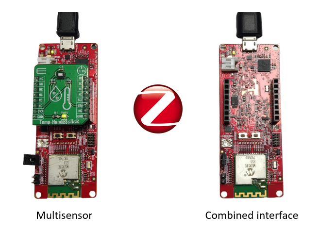

| Tip | Go through the [overview](https://onlinedocs.microchip.com/pr/GUID-A5330D3A-9F51-4A26-B71D-8503A493DF9C-en-US-2/index.html?GUID-668A6CB2-F1FB-438D-9E1E-D67AC3C1C132) for understanding few key Zigbee 3.0 protocol concepts |
| :- | :- |

## 2. Bill of materials<a name="step2">

| TOOLS | QUANTITY |
| :- | :- |
| [PIC32CX-BZ2 and WBZ451 Curiosity Development Board](https://www.microchip.com/en-us/development-tool/EV96B94A) | 2 |
| [TEMP&HUM 13 CLICK](https://www.mikroe.com/temphum-13-click) | 1 |

## 3. Hardware Setup<a name="step3">

Connect the Temp&Hum 13 click onto the Mikro bus header of the WBZ451 Curiosity board.

## 4. Software Setup<a name="step4">

- [MPLAB X IDE ](https://www.microchip.com/en-us/tools-resources/develop/mplab-x-ide#tabs)

    - Version: 6.00
	- XC32 Compiler v4.10
	- MPLAB® Code Configurator v5.1.17
	- PIC32CX-BZ_DFP v1.0.107
	- MCC Harmony
	  - csp version: v3.13.1
	  - core version: v3.11.1
	  - CMSIS-FreeRTOS: v10.4.6
	  - dev_packs: v3.13.0
	  - wolfssl version: v4.7.0
	  - crypto version: v3.7.6
	  - wireless_pic32cxbz_wbz: v1.1.0
	  - wireless_zigbee: v5.0.0

- Any Serial Terminal application like [TERA TERM](https://download.cnet.com/Tera-Term/3000-2094_4-75766675.html) terminal application

- [MPLAB X IPE v6.00](https://microchipdeveloper.com/ipe:installation)

## 5. Harmony MCC Configuration<a name="step5">

### Getting started with Multisensor application in WBZ451 Curiosity board 

| Tip | New users of MPLAB Code Configurator are recommended to go through the [overview](https://onlinedocs.microchip.com/pr/GUID-1F7007B8-9A46-4D03-AEED-650357BA760D-en-US-6/index.html?GUID-B5D058F5-1D0B-4720-8649-ACE5C0EEE2C0) |
| :- | :- |

**Step 1** - Connect the WBZ451 CURIOSITY BOARD with Temp&Hum 13 click to the device/system using a micro-USB cable.

**Step 2** - Create a [new MCC Harmony project](https://github.com/MicrochipTech/EA71C53A/blob/master/H3/wireless_apps_pic32cxbz2_wbz45/apps/docs/creating_new_mplabx_harmony_project.md#creating-a-new-mcc-harmony-project).

**Step 3** - The "MCC - Harmony Project Graph" below depicts the harmony components utilized in this project.

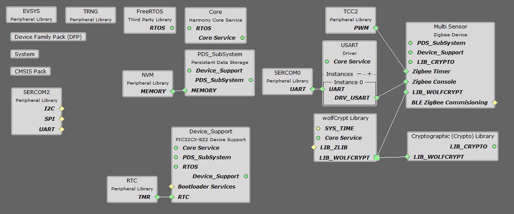

- In Device resources, go to wireless->drivers->zigbee->Device types and select Multisensor. Accept Dependencies or satisfiers, select "Yes". The MULTISENSOR configuration is depicted as follows.

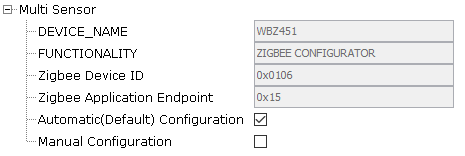

- Add UART components needed for console logs and commands. Right click on the "⬦" in Zigbee console and add the satisfier and in the same way add SERCOM0 to the USART console. 

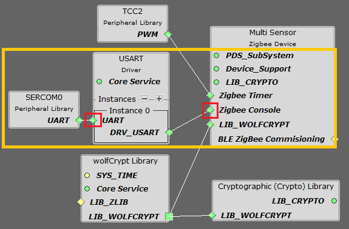

- The SERCOM0 UART configuration is depicted as follows.

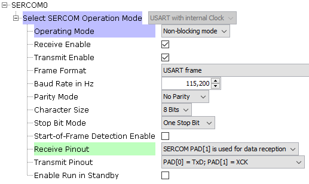

- In Device resources, go to Harmony->Peripherals->SERCOM and select SERCOM2. The SERCOM2 I2C configuration is depicted as follows.

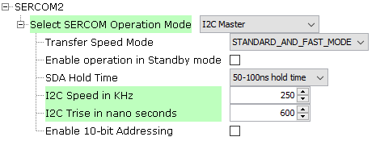

- The SYSTEM configuration is depicted as follows.

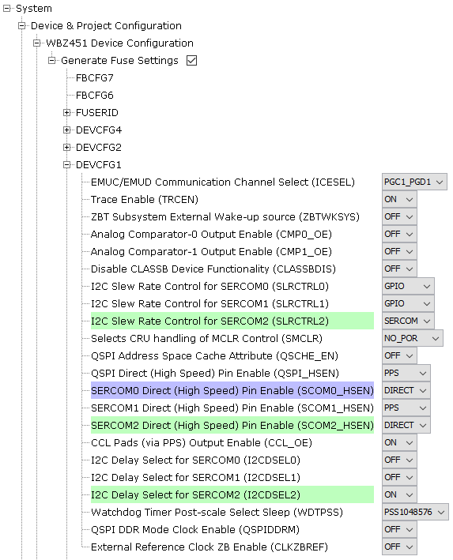

- In FreeRTOS configuration options, go to RTOS Configurations->Include components and make sure xTaskAbortDelay is selected.

**Step 4** - [Generate](https://onlinedocs.microchip.com/pr/GUID-A5330D3A-9F51-4A26-B71D-8503A493DF9C-en-US-1/index.html?GUID-9C28F407-4879-4174-9963-2CF34161398E) the code.
 
**Step 5** - In "app_user_edits.c", make sure the below code line is commented 

- "#error User action required - manually edit files as described here".

**Step 6** - Copy the mentioned files from this repository by navigating to the location mentioned below and paste it your project folder. 

| Note | This application repository should be cloned/downloaded to perform the following steps. |
| :- | :- |
| Path | PIC32CXBZ2_WBZ45x_ZIGBEE_MULTISENSOR_TEMPHUM13_CLICK\Zigbee_Multisensor_temphum |

- Copy the "app_temphum13" folder, which can be found by navigating to the following path: "PIC32CXBZ2_WBZ45x_ZIGBEE_MULTISENSOR_TEMPHUM13_CLICK\Zigbee_Multisensor_temphum\firmware\src"
- Paste the folder under source files in your project folder (...\firmware\src).

**Step 7** - Add the files in MPLAB X IDE to your project by following the steps mentioned below.

- In Projects section, right click on Source files to add the ".c" file and Header files to add the ".h" file.
- Select "Add existing items from folder".
- Select Add and browse the location of "app_temphum13" folder (...\firmware\src). 
- Make sure the "Files of type" is "C Source files" while adding ".c" files and "Header files" while adding ".h" files.
- Select the folder and click "add".

**Step 8** - From Projects, go to Source files->config->default->zigbee->z3device->multiSensor->multiSensor.c and replace the following code. In the "updateSensorsAttributeValues(void)" function comment code lines 235 to 241 and add the following code line to update the temperature and relative humidity measurement from the Temp&Hum13 click.

```
static void updateSensorsAttributeValues(void)
{
//#ifdef APP_SENSOR_TYPE_OCCUPANCY_SENSOR
//  occupancySensingToggleOccupancy();
//#endif
//
//#ifdef APP_SENSOR_TYPE_LIGHT_SENSOR
//  illuminanceMeasurementUpdateMeasuredValue();
//#endif

#ifdef APP_SENSOR_TYPE_TEMPERATURE_SENSOR
  uint16_t temperature = temphum13_get_temperature();
  tempeartureMeasurementUpdateMeasuredValue(temperature);
#endif

#ifdef APP_SENSOR_TYPE_HUMIDITY_SENSOR
  uint16_t humidity = temphum13_get_humidity();
  humidityMeasurementUpdateMeasuredValue(humidity);
#endif
  
}
```

The project file after making the above mentioned changes is shown below.

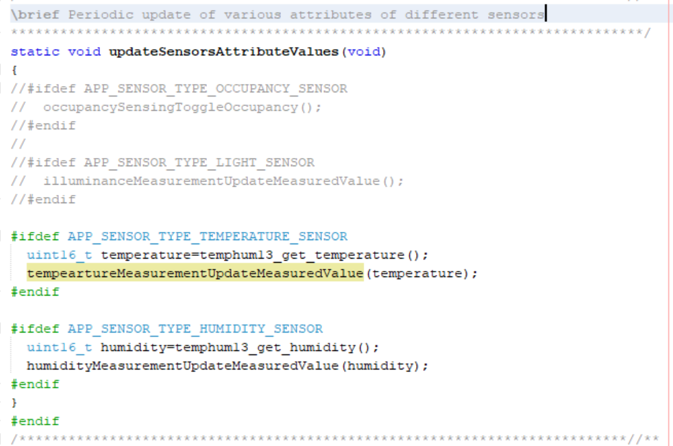

- And also add the following code in the includes section:
```
#include "app_temphum13/app_temphum13.h"
```

**Step 9** - From Projects, go to Source files->config->default->zigbee->z3device->multiSensor->tsTemperatureMeasurementCluster.c and replace the following code.

```
void tempeartureMeasurementUpdateMeasuredValue(uint16_t temp)
{
  int16_t measuredValue;
  measuredValue=(int16_t)(temp);
//  measuredValue = tsTemperatureMeasurementClusterServerAttributes.measuredValue.value - APP_TEMPERATURE_MEASUREMENT_MEASURED_VALUE_PERIODIC_CHANGE;
  if (measuredValue < tsTemperatureMeasurementClusterServerAttributes.minMeasuredValue.value)
    tsTemperatureMeasurementClusterServerAttributes.measuredValue.value =  tsTemperatureMeasurementClusterServerAttributes.maxMeasuredValue.value;
  else
    tsTemperatureMeasurementClusterServerAttributes.measuredValue.value = measuredValue;
  
  PDS_Store(APP_MS_TEMP_MEASURED_VALUE_MEM_ID);
#ifdef _ZCL_REPORTING_SUPPORT_
  printf("Temperature value:%d\r\n",measuredValue);
  ZCL_ReportOnChangeIfNeeded(&tsTemperatureMeasurementClusterServerAttributes.measuredValue);
#endif
}
```

The project file after making the above mentioned changes is shown below.

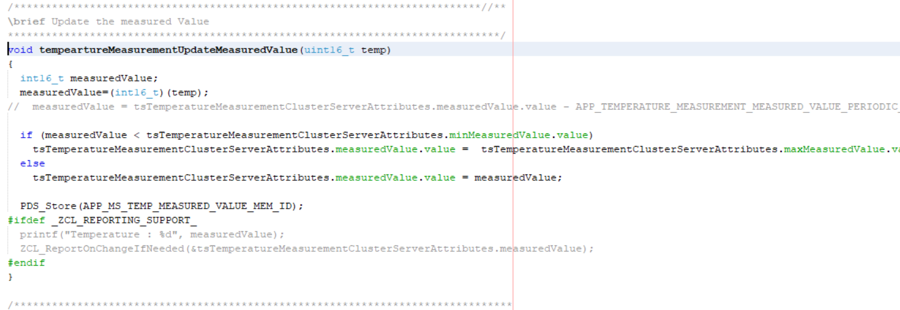

- From Projects, go to Header files->config->default->zigbee->z3device->multiSensor->include->tsTemperatureMeasurementCluster.h and replace the following code.

```
void tempeartureMeasurementUpdateMeasuredValue(uint16_t temp);
```

**Step 10** - From Projects, go to Source files->config->default->zigbee->z3device->multiSensor->hsHumidityMeasurementCluster.c and replace the following code.

```
void humidityMeasurementUpdateMeasuredValue(uint16_t humidity)
{
  uint16_t measuredValue ;
  measuredValue=humidity;
//  measuredValue = hsHumidityMeasurementClusterServerAttributes.measuredValue.value + APP_HUMIDITY_MEASUREMENT_MEASURED_VALUE_PERIODIC_CHANGE;

  if (measuredValue > hsHumidityMeasurementClusterServerAttributes.maxMeasuredValue.value)
    hsHumidityMeasurementClusterServerAttributes.measuredValue.value =  hsHumidityMeasurementClusterServerAttributes.minMeasuredValue.value;
  else
    hsHumidityMeasurementClusterServerAttributes.measuredValue.value = measuredValue;
  
  PDS_Store(APP_MS_HUMIDITY_MEASURED_VALUE_MEM_ID);
#ifdef _ZCL_REPORTING_SUPPORT_
  printf("Humidity value:%d\r\n",measuredValue);
  ZCL_ReportOnChangeIfNeeded(&hsHumidityMeasurementClusterServerAttributes.measuredValue);
#endif
}
```

The project file after making the above mentioned changes is shown below.

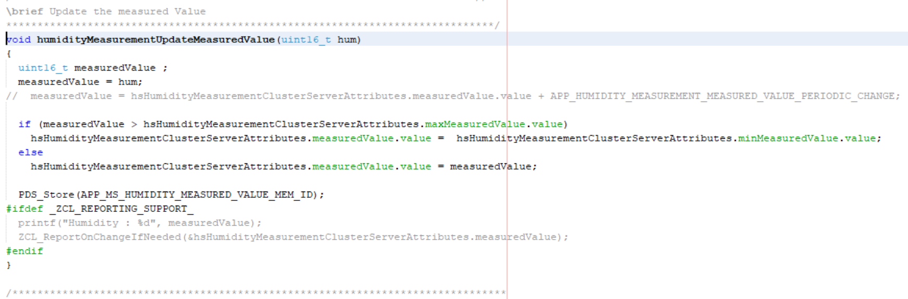

- From Projects, go to Header files->config->default->zigbee->z3device->multiSensor->include->hsHumidityMeasurementCluster.h and replace the following code.

```
void humidityMeasurementUpdateMeasuredValue(uint16_t humidity);
```

**Step 11** - From Projects, go to Header files->config->default->zigbee->z3device_configs->zigbeeAppConfig.h and comment lines 160 and 161.

```
//#define APP_SENSOR_TYPE_OCCUPANCY_SENSOR    //Occupancy Sensor Device.
//#define APP_SENSOR_TYPE_LIGHT_SENSOR
```

- From projects, go to source files->app_zigbee->app_zigbee_handler.c and comment lines 620 to 653

```
//        case CMD_ZCL_ATTR_OCCUPANCY:
//        {
//            /* Command ZCL OccupancyAttributeEventInd */
//            //Access - > event.eventData.zclAttributeData.addressing;
//            //Access - > event.eventData.zclAttributeData.attributeId;
//            //Access - > event.eventData.zclAttributeData.event;
//            ZCL_AttributeEvent_t eventzcl = event.eventData.zclAttributeData.event;
//            ZCL_AttributeId_t attributeId = event.eventData.zclAttributeData.attributeId;
//            if ((ZCL_CONFIGURE_DEFAULT_ATTRIBUTE_REPORTING_EVENT == eventzcl) && \
//                (ZCL_OCCUPANCY_SENSING_CLUSTER_OCCUPANCY_SERVER_ATTRIBUTE_ID == attributeId))
//            {
//                osOccupancySensingClusterServerAttributes.occupancy.minReportInterval = OCCUPANCY_SENSING_VAL_MIN_REPORT_PERIOD;
//                osOccupancySensingClusterServerAttributes.occupancy.maxReportInterval = OCCUPANCY_SENSING_VAL_MAX_REPORT_PERIOD;
//                osOccupancySensingClusterServerAttributes.occupancy.reportableChange = 0;     
//            }
//        }
//        break;
//        case CMD_ZCL_ATTR_ILLUMINANCE_MEASUREMENT:
//        {
//            /* Command ZCL OnOffAttributeEventInd */
//            //Access - > event.eventData.zclAttributeData.addressing;
//            //Access - > event.eventData.zclAttributeData.attributeId;
//            //Access - > event.eventData.zclAttributeData.event;
//            ZCL_AttributeEvent_t eventzcl = event.eventData.zclAttributeData.event;
//            ZCL_AttributeId_t attributeId = event.eventData.zclAttributeData.attributeId;
//            if((ZCL_CONFIGURE_DEFAULT_ATTRIBUTE_REPORTING_EVENT == eventzcl) && \
//                (ZCL_ILLUMINANCE_MEASUREMENT_CLUSTER_MEASURED_VALUE_SERVER_ATTRIBUTE_ID == attributeId))
//            {
//                lsIlluminanceMeasurementClusterServerAttributes.measuredValue.minReportInterval = ILLUMINANCE_MEASUREMENT_VAL_MIN_REPORT_PERIOD;
//                lsIlluminanceMeasurementClusterServerAttributes.measuredValue.maxReportInterval = ILLUMINANCE_MEASUREMENT_VAL_MAX_REPORT_PERIOD;
//                lsIlluminanceMeasurementClusterServerAttributes.measuredValue.reportableChange = 0;
//            }
//        }
//        break;
```

**Step 12** - To enable in printf in your project, go to Source files->config->default->stdio->xc32_monitor.c and replace with the following code.

```
#include <stddef.h>
#include "definitions.h"

extern int read(int handle, void *buffer, unsigned int len);
extern int write(int handle, void * buffer, size_t count);

int read(int handle, void *buffer, unsigned int len)
{
    int nChars = 0;
    bool success = false;
    (void)len;
    if ((handle == 0)  && (len > 0))
    {
        do
        {
            success = SERCOM0_USART_Read(buffer, 1);
        }while( !success);
        nChars = 1;
    }
    return nChars;
}

int write(int handle, void * buffer, size_t count)
{
   bool success = false;
   if (handle == 1)
   {
       do
       {
           success = SERCOM0_USART_Write(buffer, count);
       }while( !success);
   }
   return count;
}
```

**Step 13** - Clean and build the project. To run the project, select "Make and program device" button.

### Getting started with Combined Interface application in WBZ451 Curiosity board 

- Combined interface application folder will be available in this [link](https://github.com/Microchip-MPLAB-Harmony/wireless_apps_pic32cxbz2_wbz45/tree/master/apps/zigbee/combinedInterface).
- Follow the steps provided in the above mentioned link to program the board.
- To create the MCC project from scratch follow steps provided in this [link](https://github.com/MicrochipTech/PIC32CXBZ2_WBZ45x_ZIGBEE_MULTISENSOR_TEMPHUM13_CLICK/tree/main/Docs#creating-combined-interface-application-from-scratch-in-wbz451).

## 6. Board Programming<a name="step6">

### Program the precompiled hex file using MPLAB X IPE

The application hex file can be found by navigating to the following path: 
- "PIC32CXBZ2_WBZ45x_ZIGBEE_MULTISENSOR_TEMPHUM13_CLICK\Zigbee_Temperature_humidity_Sensor.X.production.hex"

Follow the steps provided in the link to [program the precompiled hex file](https://microchipdeveloper.com/ipe:programming-device) using MPLABX IPE to program the pre-compiled hex image. 

### Build and program the application using MPLAB X IDE

The application folder can be found by navigating to the following path: 
- "PIC32CXBZ2_WBZ45x_ZIGBEE_MULTISENSOR_TEMPHUM13_CLICK\Zigbee_Multisensor_temphum"

Follow the steps provided in the link to [Build and program the application](https://github.com/Microchip-MPLAB-Harmony/wireless_apps_pic32cxbz2_wbz45/tree/master/apps/ble/advanced_applications/ble_sensor#build-and-program-the-application-guid-3d55fb8a-5995-439d-bcd6-deae7e8e78ad-section).

## 7. Run the demo<a name="step7">

- After programming the board, follow the steps provided in this [link](https://onlinedocs.microchip.com/pr/GUID-A5330D3A-9F51-4A26-B71D-8503A493DF9C-en-US-2/index.html?GUID-0A5556D0-B6B7-4DD8-BEF1-D9B2B95F01ED) for joining multisensor with the combined interface coordinator.
- Once the network is established multisensor will start reporting the temperature and humidity values to Combined interface as shown below. 

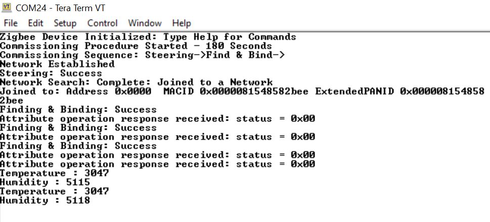

- The Combined interface terminal log will print the received attribute information as shown below.

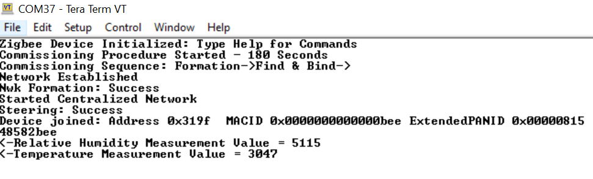

- The multisensor application can also be connected to Alexa. To connect to alexa please follow the steps mentioned below.

| Note | This step will require Alexa app |
| :- | :- |

- After plugging in your alexa , say "Alexa discover devices" and the network will be established. Go into the disovered device in the app and we can see the temperature reported in the alexa app as shown below.

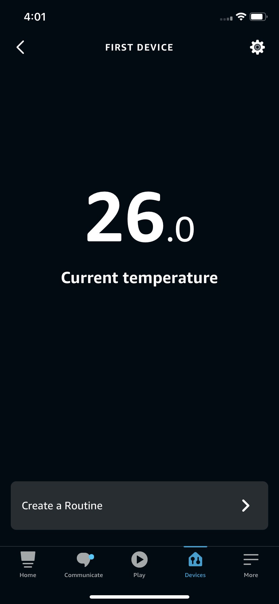	

#### Note

This application will also work with [Zigbee CI OLED Display](https://github.com/MicrochipTech/PIC32CXBZ2_WBZ45x_ZIGBEE_CI_OLED_Display).