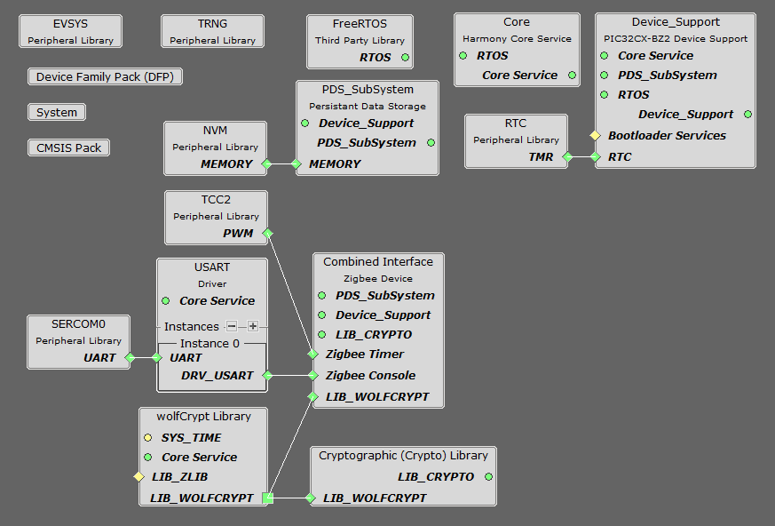

# Creating Combined Interface application from scratch in WBZ451


> "IoT Made Easy!" 

Devices: **| PIC32CXBZ2 | WBZ45x |**<br>
Features: **| ZIGBEE |**


## ⚠ Disclaimer

<p><span style="color:red"><b>
THE SOFTWARE ARE PROVIDED "AS IS" AND GIVE A PATH FOR SELF-SUPPORT AND SELF-MAINTENANCE. This repository contains example code intended to help accelerate client product development. </br>

For additional Microchip repos, see: <a href="https://github.com/Microchip-MPLAB-Harmony" target="_blank">https://github.com/Microchip-MPLAB-Harmony</a>

Checkout the <a href="https://microchipsupport.force.com/s/" target="_blank">Technical support portal</a> to access our knowledge base, community forums or submit support ticket requests.
</span></p></b>

## Contents

1. [Bill of materials](#step1)
1. [Software Setup](#step2)
1. [Harmony MCC Configuration](#step3)

## 1. Bill of materials<a name="step1">
| TOOLS | QUANTITY |
| :- | :- |
| [PIC32CX-BZ2 and WBZ451 Curiosity Development Board](https://www.microchip.com/en-us/development-tool/EV96B94A) | 1 |

## 2. Software Setup<a name="step2">

- [MPLAB X IDE ](https://www.microchip.com/en-us/tools-resources/develop/mplab-x-ide#tabs)

    - Version: 6.00
	- XC32 Compiler v4.10
	- MPLAB® Code Configurator v5.1.17
	- PIC32CX-BZ_DFP v1.0.107
	- MCC Harmony
	  - csp version: v3.13.1
	  - core version: v3.11.1
	  - CMSIS-FreeRTOS: v10.4.6
	  - dev_packs: v3.13.0
	  - wolfssl version: v4.7.0
	  - crypto version: v3.7.6
	  - wireless_pic32cxbz_wbz: v1.1.0
	  - wireless_zigbee: v5.0.0

- Any Serial Terminal application like [TERA TERM](https://download.cnet.com/Tera-Term/3000-2094_4-75766675.html) terminal application

- [MPLAB X IPE v6.00](https://microchipdeveloper.com/ipe:installation)

## 3. Harmony MCC Configuration<a name="step3">

### Getting started with Combined Interface application in WBZ451 Curiosity board

**Step 1** - Connect the WBZ451 Curiosity Board to the device/system using a micro-USB cable.

**Step 2** - Create a [new MCC Harmony project](https://github.com/MicrochipTech/EA71C53A/blob/master/H3/wireless_apps_pic32cxbz2_wbz45/apps/docs/creating_new_mplabx_harmony_project.md#creating-a-new-mcc-harmony-project).

**Step 3** - The "MCC - Harmony Project Graph" below depicts the harmony components utilized in this project.



- In Device resources, go to wireless->zigbee->Device types and select Combined Interface. Accept Dependencies or satisfiers, select "Yes". The Combined Interface configuration is depicted as follows.


- Add UART components needed for console logs and commands. Right click on the "⬦" in Zigbee console and add the satisfier and in the same way add SERCOM0 to the USART console. 


- The SERCOM0 UART configuration is depicted as follows.


- In FreeRTOS configuration options, go to RTOS Configurations->Include components and make sure xTaskAbortDelay is selected.

**Step 4** - [Generate](https://onlinedocs.microchip.com/pr/GUID-A5330D3A-9F51-4A26-B71D-8503A493DF9C-en-US-1/index.html?GUID-9C28F407-4879-4174-9963-2CF34161398E) the code.
 
**Step 5** - In "app_user_edits.c", make sure the below code line is commented 

- "#error User action required - manually edit files as described here".

**Step 6** - From Projects go to Source files->app_zigbee->app_zigbee_handler.c and replace the following code.

```
int16_t reportValue;
memcpy(&reportValue, &rep->value[0], sizeof(int16_t));
appSnprintf( "<-Temperature Measurement Value = %d\r\n", reportValue);
```


```
uint16_t reportValue;
memcpy(&reportValue, &rep->value[0], sizeof(uint16_t));
appSnprintf( "<-Relative Humidity Measurement Value = %d\r\n", reportValue);
```

**Step 8** - From Projects go to Source files->app_zigbee->app_zigbee_handler.c and **comment** the folloing code lines.

- appSnprintf("<-Occupancy Sensor Attr Report: Value = 0x%x\r\n", (int)rep->value[0]);
- appSnprintf("<-Level Control Attr Report: Value = 0x%x\r\n", (int)rep->value[0]);
- appSnprintf("<-Light Sensor Attr Report: Value = 0x%x\r\n", reportValue);
- appSnprintf("<-On/Off Attr Report: Value = 0x%x\r\n", (int)rep->value[0]);

**Step 9** - Clean and build the project. To run the project, select "Make and program device" button.
